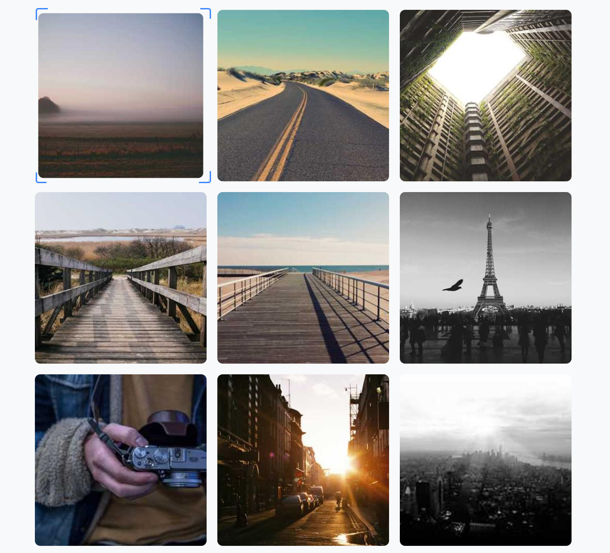

# 以下所有出现的注释都由由AI生成
# 图片选择器组件 | Image Selector Component

 <!-- 建议替换为实际截图路径 -->

## 功能特性 | Features

- 🖱️ **鼠标交互** - 悬停选择图片 | Hover to select images  
- ⌨️ **键盘导航** - 支持方向键控制 | Keyboard navigation with arrow keys  
- 🚀 **高性能** - 60FPS流畅动画 | 60FPS smooth animations  
- 📱 **响应式设计** - 适配不同屏幕尺寸 | Fully responsive design  
- ⏱️ **防抖优化** - 智能处理高频事件 | Debounced event handling  

## ✨ 核心功能

- 🖱️ **鼠标交互**  
  ```markdown
  - 悬停选择图片
  - 平滑过渡动画 (0.25s)
  ```
- ⌨️ **键盘控制**  
  ```markdown
  ↑/↓/←/→ - 导航选择
  ```
- 📱 **响应式布局**  
  ```markdown
  [Mobile] 单列布局
  [Tablet] 双列布局
  [Desktop] 三列布局
  ```

## 🛠️ 技术栈

| 技术       | 用途                  | 版本要求 |
|------------|-----------------------|----------|
| ![HTML5]   | 基础结构              | ≥5       |
| ![CSS3]    | 样式与动画            | ≥3       |
| ![JS]      | 交互逻辑              | ES6+     |

[HTML5]: https://img.shields.io/badge/HTML5-E34F26?logo=html5&logoColor=white
[CSS3]: https://img.shields.io/badge/CSS3-1572B6?logo=css3&logoColor=white
[JS]: https://img.shields.io/badge/JavaScript-F7DF1E?logo=javascript&logoColor=black

## 🚀 快速开始

### 基础使用 | Basic Usage

# HTML
```html
<!DOCTYPE html>
<!-- 文档类型声明 | Document Type Declaration -->
<html lang="en">
<!-- 主文档开始 | Main document start -->
<head>
    <!-- 文档元信息开始 | Document metadata start -->
    <meta charset="UTF-8">
    <!-- 字符编码声明 | Character encoding declaration -->
    <meta name="viewport" content="width=device-width, initial-scale=1.0">
    <!-- 响应式视口设置 | Responsive viewport settings -->
    <title>Optimized Image Selector</title>
    <!-- 页面标题 | Page title -->
    <link rel="stylesheet" href="index.css">
    <!-- 外部样式表链接 | External stylesheet link -->
</head>
<!-- 文档元信息结束 | Document metadata end -->
<body>
    <!-- 文档内容开始 | Document content start -->
    <div class="container">
        <!-- 图片容器开始 | Image container start -->
        <div class="selection-border"></div>
        <!-- 选择框元素 | Selection border element -->
        
        <!-- 图片项开始（重复9个） | Image items start (repeated 9 times) -->
        <div class="item">
            
            <!-- 图片元素，启用懒加载 | Image element with lazy loading -->
        </div>
        <div class="item">
            
            <!-- 图片元素，启用懒加载 | Image element with lazy loading -->
        </div>
        <div class="item">
            
            <!-- 图片元素，启用懒加载 | Image element with lazy loading -->
        </div>
        <div class="item">
            
            <!-- 图片元素，启用懒加载 | Image element with lazy loading -->
        </div>
        <div class="item">
            
            <!-- 图片元素，启用懒加载 | Image element with lazy loading -->
        </div>
        <div class="item">
            
            <!-- 图片元素，启用懒加载 | Image element with lazy loading -->
        </div>
        <div class="item">
            
            <!-- 图片元素，启用懒加载 | Image element with lazy loading -->
        </div>
        <div class="item">
            
            <!-- 图片元素，启用懒加载 | Image element with lazy loading -->
        </div>
        <div class="item">
            
            <!-- 图片元素，启用懒加载 | Image element with lazy loading -->
        </div>
        <div class="item">
            
            <!-- 图片元素，启用懒加载 | Image element with lazy loading -->
        </div>
        <div class="item">
            
            <!-- 图片元素，启用懒加载 | Image element with lazy loading -->
        </div>
        <div class="item">
            
            <!-- 图片元素，启用懒加载 | Image element with lazy loading -->
        </div>
        <div class="item">
            
            <!-- 图片元素，启用懒加载 | Image element with lazy loading -->
        </div>
        <div class="item">
            
            <!-- 图片元素，启用懒加载 | Image element with lazy loading -->
        </div>
        <div class="item">
            
            <!-- 图片元素，启用懒加载 | Image element with lazy loading -->
        </div>
    </div>
    <!-- 图片容器结束 | Image container end -->
    <script src="index.js"></script>
    <!-- 外部JavaScript文件链接 | External JavaScript file link -->
</body>
<!-- 文档内容结束 | Document content end -->
</html>
<!-- 主文档结束 | Main document end -->
```

# CSS

```CSS
/* 根变量定义 | Root variables definition */
:root {
    --accent-color: #3a86ff; /* 主色调 | Primary accent color */
    --transition-speed: 0.25s; /* 过渡动画速度 | Transition animation speed */
}

/* 全局重置 | Global reset */
* {
    margin: 0; /* 外边距归零 | Reset margin */
    padding: 0; /* 内边距归零 | Reset padding */
    box-sizing: border-box; /* 盒模型计算方式 | Box model calculation method */
}

/* 页面主体样式 | Body styles */
body {
    min-height: 100vh; /* 最小高度为视口高度 | Minimum height as viewport height */
    display: grid; /* 使用网格布局 | Use grid layout */
    place-items: center; /* 内容居中 | Center content */
    background: #f8f9fa; /* 背景颜色 | Background color */
    font-family: system-ui, sans-serif; /* 系统默认字体 | System default font */
}

/* 图片容器样式 | Image container styles */
.container {
    display: grid; /* 网格布局 | Grid layout */
    grid-template-columns: repeat(3, minmax(0, 1fr)); /* 3列响应式网格 | 3-column responsive grid */
    gap: 1.5rem; /* 网格间隙 | Grid gap */
    max-width: 1200px; /* 最大宽度 | Maximum width */
    width: 90%; /* 相对宽度 | Relative width */
    margin: 0 auto; /* 水平居中 | Horizontal center */
    position: relative; /* 相对定位 | Relative positioning */
}

/* 单个图片项样式 | Individual image item styles */
.item {
    position: relative; /* 相对定位 | Relative positioning */
    aspect-ratio: 1/1; /* 保持1:1宽高比 | Maintain 1:1 aspect ratio */
    border-radius: 12px; /* 圆角边框 | Rounded corners */
    overflow: hidden; /* 内容溢出隐藏 | Hide overflow */
    cursor: pointer; /* 鼠标指针样式 | Cursor style */
    transition: transform var(--transition-speed) ease; /* 变换动画 | Transform animation */
    contain: layout; /* 性能优化：布局隔离 | Performance optimization: layout containment */
}

/* 图片元素样式 | Image element styles */
.item img {
    position: absolute; /* 绝对定位 | Absolute positioning */
    width: 100%; /* 宽度100% | Full width */
    height: 100%; /* 高度100% | Full height */
    object-fit: cover; /* 图片填充方式 | Image fill method */
    transition: transform var(--transition-speed) ease; /* 变换动画 | Transform animation */
}

/* 选择框样式 | Selection border styles */
.selection-border {
    position: absolute; /* 绝对定位 | Absolute positioning */
    pointer-events: none; /* 禁用指针事件 | Disable pointer events */
    z-index: 10; /* 堆叠顺序 | Stacking order */
    left: 0; /* 初始位置 | Initial position */
    top: 0; /* 初始位置 | Initial position */
    transition: 
        width var(--transition-speed) ease,
        height var(--transition-speed) ease,
        transform var(--transition-speed) ease; /* 多属性过渡动画 | Multiple property transitions */
    will-change: transform; /* 性能提示：将要变化 | Performance hint: will change */
}

/* 选择框伪元素（四角样式） | Selection border pseudo-elements (corner styles) */
.selection-border::before,
.selection-border::after {
    content: ''; /* 必须内容属性 | Required content property */
    position: absolute; /* 绝对定位 | Absolute positioning */
    width: 24px; /* 宽度 | Width */
    height: 24px; /* 高度 | Height */
}

/* 左上角样式 | Top-left corner style */
.selection-border::before {
    top: -4px; /* 上偏移 | Top offset */
    left: -4px; /* 左偏移 | Left offset */
    border-top: 3px solid var(--accent-color); /* 上边框 | Top border */
    border-left: 3px solid var(--accent-color); /* 左边框 | Left border */
    border-radius: 6px 0 0 0; /* 圆角 | Border radius */
}

/* 右下角样式 | Bottom-right corner style */
.selection-border::after {
    bottom: -4px; /* 下偏移 | Bottom offset */
    right: -4px; /* 右偏移 | Right offset */
    border-bottom: 3px solid var(--accent-color); /* 下边框 | Bottom border */
    border-right: 3px solid var(--accent-color); /* 右边框 | Right border */
    border-radius: 0 0 6px 0; /* 圆角 | Border radius */
}

/* 右上角样式（通过JS动态添加） | Top-right corner style (added dynamically via JS) */
.selection-border .corner-tr {
    position: absolute; /* 绝对定位 | Absolute positioning */
    top: -4px; /* 上偏移 | Top offset */
    right: -4px; /* 右偏移 | Right offset */
    width: 24px; /* 宽度 | Width */
    height: 24px; /* 高度 | Height */
    border-top: 3px solid var(--accent-color); /* 上边框 | Top border */
    border-right: 3px solid var(--accent-color); /* 右边框 | Right border */
    border-radius: 0 6px 0 0; /* 圆角 | Border radius */
}

/* 左下角样式（通过JS动态添加） | Bottom-left corner style (added dynamically via JS) */
.selection-border .corner-bl {
    position: absolute; /* 绝对定位 | Absolute positioning */
    bottom: -4px; /* 下偏移 | Bottom offset */
    left: -4px; /* 左偏移 | Left offset */
    width: 24px; /* 宽度 | Width */
    height: 24px; /* 高度 | Height */
    border-bottom: 3px solid var(--accent-color); /* 下边框 | Bottom border */
    border-left: 3px solid var(--accent-color); /* 左边框 | Left border */
    border-radius: 0 0 0 6px; /* 圆角 | Border radius */
}

/* 激活状态的图片项 | Active image item state */
.item.active {
    transform: scale(0.96); /* 轻微缩小效果 | Slight scale down effect */
}

/* 激活状态的图片 | Active image state */
.item.active img {
    transform: scale(1.04); /* 轻微放大效果 | Slight scale up effect */
    filter: brightness(1.05); /* 亮度微调 | Brightness adjustment */
}

/* 平板设备响应式设计 | Tablet responsive design */
@media (max-width: 768px) {
    .container {
        grid-template-columns: repeat(2, 1fr); /* 2列布局 | 2-column layout */
        gap: 1rem; /* 减小间隙 | Reduce gap */
    }
}

/* 手机设备响应式设计 | Mobile responsive design */
@media (max-width: 480px) {
    .container {
        grid-template-columns: 1fr; /* 单列布局 | Single column layout */
    }
}
```

# JAVASCRIPT

```JAVASCRIPT
/**
 * 图片选择器类 | Image Selector Class
 * 实现带键盘导航的图片选择功能 | Implements image selection with keyboard navigation
 */
class ImageSelector {
    /**
     * 构造函数 | Constructor
     * 初始化所有必要属性和事件处理器 | Initializes all necessary properties and event handlers
     */
    constructor() {
        // DOM元素引用 | DOM element references
        this.container = document.querySelector('.container'); // 主容器 | Main container
        this.items = document.querySelectorAll('.item'); // 所有图片项 | All image items
        this.border = document.querySelector('.selection-border'); // 选择框 | Selection border
        
        // 状态变量 | State variables
        this.currentIndex = 0; // 当前选中索引 | Current selected index
        this.cols = 3; // 默认列数 | Default column count
        this.activeItem = null; // 当前激活项 | Currently active item
        
        // 绑定事件处理器（避免this问题） | Bind event handlers (to avoid this issues)
        this.boundHandleResize = this.debounce(this.handleResize.bind(this), 100);
        this.boundKeyHandler = this.handleKeyDown.bind(this);
        this.boundMouseHandler = this.handleMouseOver.bind(this);
        
        // 初始化组件 | Initialize component
        this.init();
    }

    /**
     * 初始化方法 | Initialization method
     * 设置组件的基础状态 | Sets up the basic state of the component
     */
    init() {
        this.createCorners(); // 创建选择框四角 | Create selection border corners
        this.setupEventListeners(); // 设置事件监听 | Set up event listeners
        this.activateItem(0); // 默认激活第一个项目 | Activate first item by default
        this.updateColsCount(); // 计算当前列数 | Calculate current column count
    }

    /**
     * 创建选择框四角 | Create selection border corners
     * 动态添加右上和左下角（其他角通过CSS实现） | Dynamically add top-right and bottom-left corners (others via CSS)
     */
    createCorners() {
        ['tr', 'bl'].forEach(type => {
            const corner = document.createElement('div');
            corner.className = `corner-${type}`;
            this.border.appendChild(corner);
        });
    }

    /**
     * 防抖函数 | Debounce function
     * 防止频繁触发事件（如resize） | Prevents frequent event triggering (e.g. resize)
     * @param {Function} func - 要防抖的函数 | Function to debounce
     * @param {number} wait - 等待时间(ms) | Wait time in milliseconds
     * @returns {Function} - 防抖后的函数 | Debounced function
     */
    debounce(func, wait = 100) {
        let timeout;
        return (...args) => {
            clearTimeout(timeout);
            timeout = setTimeout(() => func.apply(this, args), wait);
        };
    }

    /**
     * 更新列数计算 | Update column count calculation
     * 根据CSS网格计算当前列数 | Calculates current column count based on CSS grid
     */
    updateColsCount() {
        const gridColumns = getComputedStyle(this.container).gridTemplateColumns;
        this.cols = gridColumns.split(' ')
            .filter(s => s.trim()).length; // 计算有效列数 | Count valid columns
    }

    /**
     * 更新选择框位置 | Update selection border position
     * 根据目标元素定位选择框 | Positions selection border relative to target element
     * @param {HTMLElement} target - 目标DOM元素 | Target DOM element
     */
    updateBorderPosition(target) {
        const rect = target.getBoundingClientRect(); // 目标元素位置 | Target element position
        const containerRect = this.container.getBoundingClientRect(); // 容器位置 | Container position
        
        // 使用transform实现高性能定位 | Use transform for high-performance positioning
        Object.assign(this.border.style, {
            width: `${rect.width}px`,
            height: `${rect.height}px`,
            transform: `translate(
                ${rect.left - containerRect.left}px,
                ${rect.top - containerRect.top}px
            )`
        });
    }

    /**
     * 激活指定项目 | Activate specified item
     * 更新选中状态和UI | Updates selection state and UI
     * @param {number} index - 要激活的项目索引 | Index of item to activate
     */
    activateItem(index) {
        // 移除之前激活项的类名 | Remove active class from previous item
        if (this.activeItem) {
            this.activeItem.classList.remove('active');
        }
        
        // 设置新激活项 | Set new active item
        this.activeItem = this.items[index];
        this.activeItem.classList.add('active');
        this.updateBorderPosition(this.activeItem);
        this.currentIndex = index;
    }

    /**
     * 鼠标悬停事件处理 | Mouse over event handler
     * 使用事件委托处理图片项悬停 | Uses event delegation for image item hover
     * @param {Event} e - 鼠标事件对象 | Mouse event object
     */
    handleMouseOver(e) {
        const item = e.target.closest('.item'); // 查找最近的图片项 | Find closest image item
        if (item) {
            const index = Array.from(this.items).indexOf(item); // 获取索引 | Get index
            if (index !== -1) {
                this.activateItem(index); // 激活项目 | Activate item
            }
        }
    }

    /**
     * 键盘事件处理 | Keyboard event handler
     * 实现键盘导航功能 | Implements keyboard navigation
     * @param {KeyboardEvent} e - 键盘事件对象 | Keyboard event object
     */
    handleKeyDown(e) {
        const { key } = e;
        
        // 键盘操作映射 | Keyboard action mappings
        const keyActions = {
            ArrowUp: () => Math.max(0, this.currentIndex - this.cols), // 上移 | Move up
            ArrowDown: () => Math.min(this.items.length - 1, this.currentIndex + this.cols), // 下移 | Move down
            ArrowLeft: () => Math.max(0, this.currentIndex - 1), // 左移 | Move left
            ArrowRight: () => Math.min(this.items.length - 1, this.currentIndex + 1), // 右移 | Move right
            default: () => this.currentIndex // 默认无操作 | Default no action
        };

        // 计算新索引 | Calculate new index
        const newIndex = (keyActions[key] || keyActions.default)();
        
        // 如果索引变化则更新 | Update if index changed
        if (newIndex !== this.currentIndex) {
            this.activateItem(newIndex);
            // 平滑滚动到视图 | Smooth scroll into view
            this.items[newIndex].scrollIntoView({
                behavior: 'smooth',
                block: 'nearest'
            });
        }
    }

    /**
     * 窗口大小调整处理 | Window resize handler
     * 响应式布局调整 | Responsive layout adjustments
     */
    handleResize() {
        this.updateColsCount(); // 更新列数 | Update column count
        this.updateBorderPosition(this.items[this.currentIndex]); // 重定位选择框 | Reposition selection border
    }

    /**
     * 设置事件监听器 | Set up event listeners
     * 绑定所有必要的事件 | Binds all necessary events
     */
    setupEventListeners() {
        // 使用事件委托优化鼠标事件 | Use event delegation for mouse events
        this.container.addEventListener('mouseover', this.boundMouseHandler);
        // 键盘导航 | Keyboard navigation
        document.addEventListener('keydown', this.boundKeyHandler);
        // 防抖的resize事件 | Debounced resize event
        window.addEventListener('resize', this.boundHandleResize);
    }

    /**
     * 清理方法 | Cleanup method
     * 移除所有事件监听器 | Removes all event listeners
     */
    destroy() {
        window.removeEventListener('resize', this.boundHandleResize);
        this.container.removeEventListener('mouseover', this.boundMouseHandler);
        document.removeEventListener('keydown', this.boundKeyHandler);
    }
}

// 初始化图片选择器 | Initialize image selector
let selector;
document.addEventListener('DOMContentLoaded', () => {
    selector = new ImageSelector();
});

// 全局清理方法（可选） | Global cleanup method (optional)
window.cleanupImageSelector = () => selector?.destroy();
